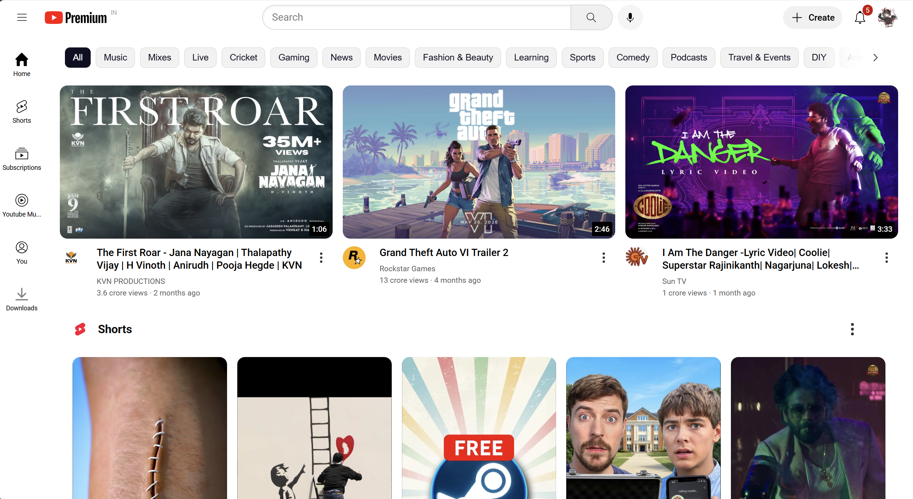
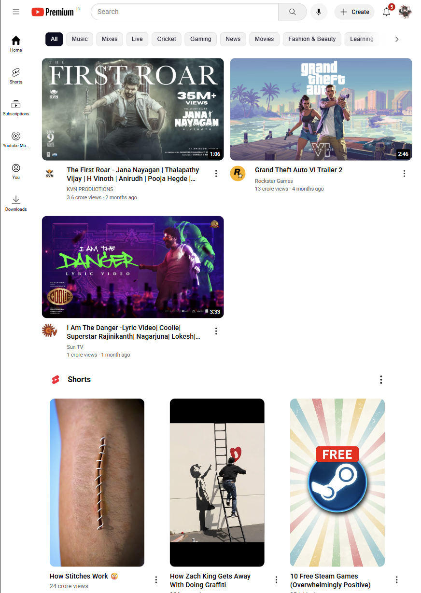

# YouTube UI Clone (HTML & CSS)

A **static YouTube homepage clone** built using only HTML and CSS.  
This project focuses on layout, styling, and responsiveness — no JavaScript.

---

## Demo / Screenshots

### Desktop View


### Tablet View


---

## Features

- Responsive layout with header, sidebar, and video grid  
- Hover effects on thumbnails and navigation items  
- Video cards with title, channel name, and view count  
- Pure HTML & CSS (no frameworks or libraries)

---

## Technologies Used

- HTML5  
- CSS3 (Flexbox, Grid, Media Queries)

---

## How to Run Locally

1. Clone the repository:
   ```bash
   git clone https://github.com/InfiKnight-TGP/YouTube-Clone.git
   ```
2. Navigate into the project folder:
   ```bash
   cd YouTube-Clone
   ```
3. Open `youtube.html` in your browser.

---

## Inspiration / Credits

I followed the **“HTML & CSS Full Course – Beginner to Pro”** tutorial.  
[Watch here](https://youtu.be/G3e-cpL7ofc?si=kIH0vv15XxnNtmc8)
